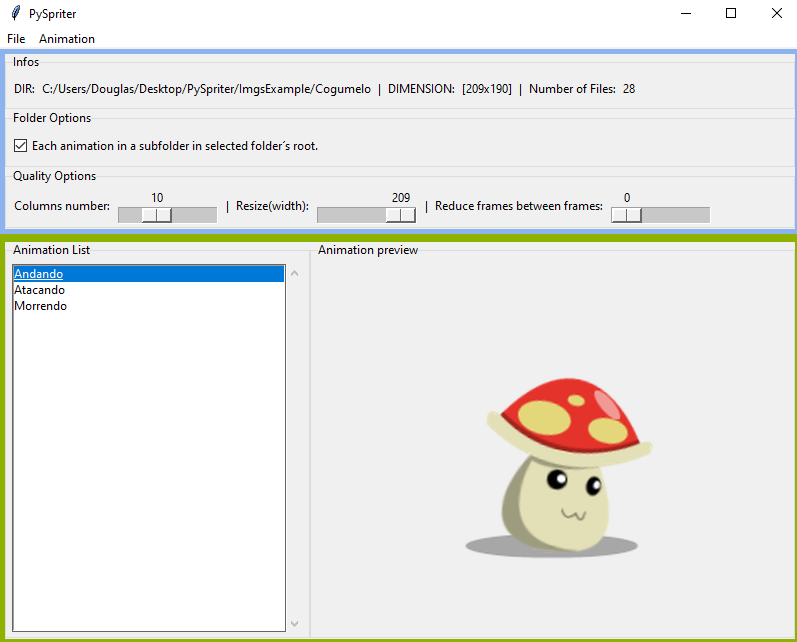

# PySpriter

It is a personal project to study python.
Not completed, it is a openSource sprite generator.

# Dependency
  pip install pillow

# About

Application writen in **Python 3** using the library **Pillow**.

The main idea of this application is: 
  1. Load one or more animations with a high volume of frames and help reducing it without losing animation quality.
  2. Help reducing size of the images without losing quality.
  3. Convert many png files into a sprite sheet and vice versa.
  4. Change the resolution of the sprite.
